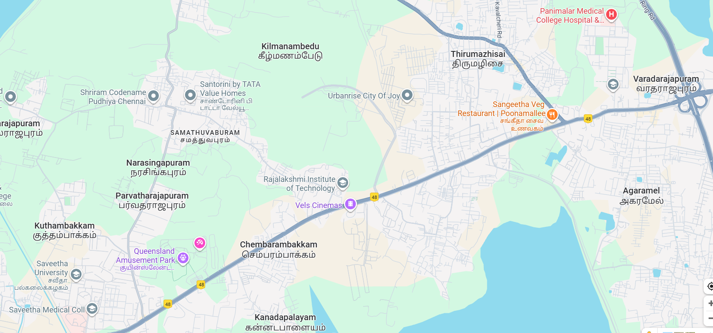

# Ex04 Places Around Me
# Date:30-09-2025
# AIM
To develop a website to display details about the places around my house.

# DESIGN STEPS
## STEP 1
Create a Django admin interface.

## STEP 2
Download your city map from Google.

## STEP 3
Using <map> tag name the map.

## STEP 4
Create clickable regions in the image using <area> tag.

## STEP 5
Write HTML programs for all the regions identified.

## STEP 6
Execute the programs and publish them.

# CODE
```
map.html:

<html>
    <head>
        <title>My city</title>
    </head>
    <body>
        <h1 align="center">
            <font color="cyan"><b>Thandalam</b></font>
        </h1>
        <h3 align="center">
            <font color="black"><b>Shankar S B (25017085)</b></font>
        </h3>
        <center>
            
            <map name="Mycity">
                <area shape="rect" coords="430,734,180,651" title="SEC" href="Saveetha.html">
    <area shape="rect" coords="784,415,808,438" title="RIT" href="RIT.html">
    <area shape="rect" coords="412,592,436,611" title="Queens Land" href="queensland.html">
    <area shape="rect" coords="803,468,821,490" title="Movie theatre" href="vels cinema.html">
    <area shape="rect" coords="1416,190,1435,211" title="PEC" href="panimalar.html">
            </map>
        </center>
    </body>
</html>

saveetha.html:

<html>
<head>
<title>Thandalam</title>
</head>
<body bgcolour="blue">
    <style>
        body{
            background-color:darkgrey;
            font-family: fantasy;
            margin: 20px;
        }
        p{
            color:blueviolet;
            font-size: 20px;
        }
        h1{
            color:aquamarine;
        }
    </style>
<h1 align="center">    
<font colour="blue"><b>Saveetha Engineering College</b></font>
</h1>
<center></center>
<p align="justify">
Saveetha Engineering College (SEC), established in 2001 and located in Thandalam, Chennai, is a private autonomous institution affiliated with Anna University and approved by AICTE. Managed by the Saveetha Medical & Educational Trust, SEC is NAAC-accredited with an 'A' grade and several programs are NBA-accredited. The college offers a wide range of undergraduate and postgraduate courses including Computer Science, Artificial Intelligence & Data Science, ECE, Mechanical, Civil, Biomedical, and Agricultural Engineering, along with MBA and research programs. Spread across a 120-acre campus near Chembarambakkam Lake, SEC provides modern academic infrastructure, well-equipped labs, libraries, hostels, and sports facilities. It maintains a strong placement record, with around 97% of students placed in recent years, top packages reaching ₹34 LPA, and an average CTC of ₹5–6 LPA through over 300 recruiting companies annually. The institution is also recognized as a Scientific and Industrial Research Organization (SIRO) by the Government of India, reinforcing its emphasis on research and innovation.
</p>
</body>
</html>

panimalar.html:

<html>
<head>
<title>Thandalam</title>
</head>
<body bgcolour="yellow">
    <style>
        body{
            background-color: limegreen;
            font-family: Verdana, Geneva, Tahoma, sans-serif;
            margin: 33px;
        }
        h1{
            color:blanchedalmond;
            font-size:40px;
        }
        p{
            color:aliceblue;
            font-size: x-large;
        }
    </style>
<h1 align="center">    
<font colour="orange"><b>Panimalar Engineering College</b></font>
</h1>
<center></center>
<p align="justify">
Panimalar Engineering College is a private Christian minority institution located in Poonamallee, Chennai, Tamil Nadu. Established in 2000 and affiliated with Anna University, the college is approved by AICTE and accredited by the National Board of Accreditation (NBA) for several of its programs. It is managed by the Jaisakthi Educational Trust and emphasizes holistic education with a strong focus on discipline, ethics, and academic excellence. The college offers a range of undergraduate and postgraduate engineering courses in fields like Computer Science, Electronics and Communication, Electrical Engineering, Information Technology, Mechanical, and Civil Engineering. It also has research opportunities through Ph.D. programs in selected departments. The campus is well-equipped with modern infrastructure, including advanced laboratories, libraries, and centres of excellence. Admissions are primarily through TNEA counselling, and the fee structure is typical of private institutions in Tamil Nadu. With a consistent emphasis on quality education and character development, Panimalar Engineering College is known for producing technically competent and socially responsible graduates.
</p>
</body>
</html>

RIT.html:
<html>
<head>
<title>Thandalam</title>
</head>
<style>
    body{
        background-color: cornflowerblue;
        font-family: Cambria, Cochin, Georgia, Times, 'Times New Roman', serif;
        margin:35px;
    }
    h1{
        font-size:xx-large;
        font-family: Impact, Haettenschweiler, 'Arial Narrow Bold', sans-serif;
        color: beige;
    }
    p{
        font-size: x-large;
    }
</style>
<body bgcolour="pink">
<h1 align="center">    
<font colour="cyan"><b>Rajalakshmi Institute of Technology</b></font>
</h1>
<center></center>
<p align="justify">
Rajalakshmi Institute of Technology (RIT) is a private autonomous engineering college located in Chennai, Tamil Nadu. Established in 2008, it is affiliated with Anna University and approved by AICTE. The institute holds accreditations from NBA for various programs and has been awarded an A++ grade by NAAC, reflecting its strong academic standards. RIT offers a range of undergraduate programs such as B.E. in Computer Science and Engineering, Electronics and Communication Engineering, Mechanical Engineering, as well as newer courses like Artificial Intelligence & Data Science and Computer Science & Business Systems. It also offers postgraduate programs and Ph.D. research opportunities. The campus is spread over nearly 11 acres and includes well-equipped academic blocks, modern laboratories, digital classrooms, a central library, and facilities for sports and fitness. RIT places a strong emphasis on placements, with a consistent record of over 95% placement rates and top packages reaching up to ₹44 LPA, while the average packages typically range between ₹4–5 LPA. The institute is known for its focus on emerging technologies, industry-aligned curriculum, and student development. However, students are advised to consider factors like hostel conditions, total fee structure, and branch-specific opportunities when making a decision.
</p>
</body>

queensland.html:

<html>
<head>
<title>Thandalam</title>
</head>
<body bgcolour="pink">
    <style>
        body{
            background-color:black;
            font-family:Verdana, Geneva, Tahoma, sans-serif ;
            padding:20px ;
        }
        h1{
            background-color:darkblue;
            color:white;
            text-align: center;
        }
        p{
            background-color:honeydew;
            border:2px;
            font-size: 23px;
            color: bisque;
        }
    </style>
<h1 align="center">    
<font colour="cyan"><b>Queensland</b></font>
</h1>
<center></center>
<p align="justify">
Queens Land Amusement and Water Park in Chennai is a popular entertainment destination located on the Chennai-Bangalore Highway near Sriperumbudur and Poonamallee. Spread over 70 acres, it was established in 2003 and offers around 51 rides catering to both adults and children, including thrilling attractions like the Free Fall Tower, water slides, and cable cars. The park operates from 9:30 AM to 6 PM on weekdays, with extended hours on weekends and holidays. It provides various facilities such as food courts, locker rooms, and free parking. Entry fees are approximately ₹750 for adults and ₹650 for children, with free entry for very young kids. Known for its family-friendly environment and well-maintained rides, Queens Land remains a favorite spot for fun and recreation among locals and visitors alike.
</p>
</body>
</html>

vels cinema:
<html>
<head>
<title>Thandalam</title>
</head>
<body bgcolour="blue">
    <style>
        body{
            background-color: aqua;
            font-family: 'Franklin Gothic Medium', 'Arial Narrow', Arial, sans-serif;
        }
        h1{
            background-color: color(srgb-linear red green blue);
            font-size:xx-large;
            font-family: 'Segoe UI', Tahoma, Geneva, Verdana, sans-serif:
        }
        p{
            font-family: 'Lucida Sans', 'Lucida Sans Regular', 'Lucida Grande', 'Lucida Sans Unicode', Geneva, Verdana, sans-serif;
            font-size: 25px;
        }

    </style>
<h1 align="center">    
<font colour="cyan"><b>Vels Cinema</b></font>
</h1>
<center></center>
<p align="justify">
Vels Cinema located at EVP Santhosha Nagar on the Chennai–Bangalore National Highway near Chembarambakkam, Poonamallee, is a modern multiplex offering a premium movie experience. Known for its advanced screening technology, the theatre features multiple screens with **4K projection and Dolby Atmos** sound systems, ensuring high-quality visuals and immersive audio. It has ample parking space, clean premises, and a comfortable seating arrangement. Popular among locals for both Tamil and other language releases, Santosa supports online ticket booking through platforms like TicketNew. The theatre’s location near Poonamallee makes it easily accessible, and it has received positive feedback for its well-maintained facilities and spacious atmosphere. For queries, it can be reached at +91 85258 11111.
</p>
</body>
</html>
```
# OUTPUT


# RESULT
The program for implementing image maps using HTML is executed successfully.
